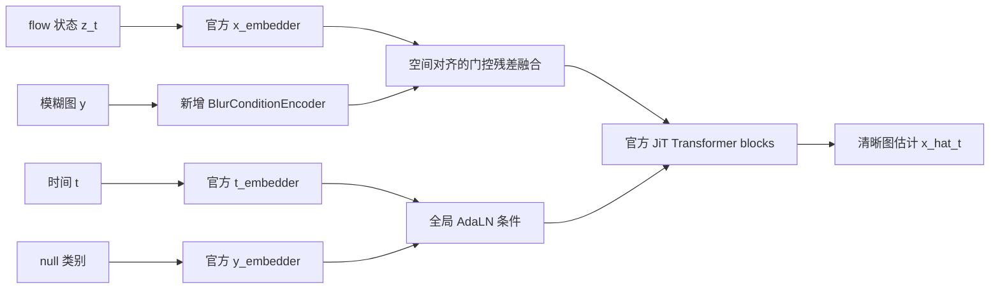

# JiT A0 网络改造说明

## 1. 改造目标

官方 JiT 的任务是类别条件图像生成：

```text
随机噪声 + ImageNet 类别标签
                ↓
          生成该类别的一张图
```

本项目 A0 的任务是配对条件恢复：

```text
随机噪声/flow状态 + 当前时间 + 具体模糊图的空间条件
                              ↓
                 恢复与输入对应的清晰细胞图
```

改造遵循以下边界：

- 保留官方像素空间 flow 路径。
- 保留官方 JiT-B/16 主干和预训练参数。
- 推理仍从随机噪声开始，不把模糊图改成 flow 起点。
- 新增模糊图空间条件，不把人工清晰图作为推理输入。
- A0 不实现 PSF、核掩膜、异常检测或细胞学特征约束。
- 为 A1～A3 预留 `degradation=None` 接口，但不静默接受未实现条件。

## 2. 官方 JiT 原始结构

官方核心调用近似为：

```python
x_tokens = x_embedder(z_t)
t_emb = t_embedder(t)
class_emb = y_embedder(class_label)
c = t_emb + class_emb
prediction = transformer(x_tokens, c)
```

其中：

- `z_t` 是噪声到清晰图路径中的当前状态。
- `x_embedder` 把 RGB flow 状态切成 patch token。
- `t_embedder` 编码生成时间。
- `y_embedder` 只编码 ImageNet 类别编号，不是图像编码器。
- Transformer 输出当前时间下的清晰图估计。

官方类别条件是全局语义，不能直接表示“这张模糊图中细胞在哪里”。

## 3. A0 改造后的结构



数学形式为：

\[
h_z=E_z(z_t)+P,
\]

\[
h_y=g_y A_y(E_y(y)),
\]

\[
h_0=h_z+h_y.
\]

其中：

- `E_z` 是官方 `x_embedder`。
- `E_y` 是新增模糊图 patch encoder。
- `A_y` 是可训练适配器。
- `g_y` 是零初始化可学习门控。
- `P` 是官方位置编码。

模糊图与 flow 状态使用同样的 patch 网格，因此第 `i` 个条件 token 与第 `i` 个状态 token 对应同一空间区域。

## 4. 为什么不直接改成 6 通道

一种简单做法是：

```python
torch.cat([z_t, blur], dim=1)  # 6 channels
```

但 A0 没采用该方案，原因是：

1. 会修改官方输入层的通道数，无法直接复用其权重。
2. flow 状态与条件图职责混在一起，不利于后续单独加入退化条件。
3. 难以控制新增条件在初始化时对预训练主干的影响。
4. 独立条件编码器更方便缓存同一模糊图的条件特征。

像素空间表示不等于不做 patch embedding。JiT 的生成状态和输出仍是 RGB 像素；patch embedding 只是 Transformer 内部的特征转换，不是 VAE 潜空间。

## 5. 新增 `BlurConditionEncoder`

文件：`JiT/model_jit.py`

结构：

```text
模糊图 [B,3,256,256]
        ↓ BottleneckPatchEmbed
条件token [B,256,768]
        ↓ RMSNorm + Linear adapter
适配条件token [B,256,768]
        ↓ tanh(gate)
门控条件残差
```

对于 JiT-B/16：

- patch size：16；
- token 网格：16×16；
- token 数：256；
- bottleneck 维度：128；
- hidden size：768。

门控参数从 0 开始，使刚加载官方权重时新增分支不会立即破坏原模型行为。训练后门控自行学习条件强度。

## 6. 官方类别条件如何处理

A0 没有删除 `y_embedder`，原因是：

- 官方 checkpoint 中包含类别 embedding；
- Transformer 的全局条件和 in-context token 依赖该结构；
- 删除会扩大 checkpoint 不兼容范围。

A0 统一使用官方的 null/unconditional 类别编号：

```python
labels = torch.full(
    (batch_size,),
    num_classes,
    dtype=torch.long,
    device=device,
)
```

因此类别 embedding只作为预训练结构兼容项；真正区分当前恢复对象的是模糊图空间条件。

## 7. 条件如何作用于每个 ODE 时间步

推理时采样器反复调用：

```python
for t in timesteps:
    x_pred = net(z_t, t, null_labels, blur=blur)
    v_pred = (x_pred - z_t) / (1 - t)
    z_t = ode_step(z_t, v_pred)
```

`z_t` 和 `t` 每一步变化，`blur` 始终是同一张输入图。因此每个生成时间步都受到同一空间条件约束。

当前实现每次调用都会执行条件编码器。后续如果需要优化推理速度，可以增加 `encode_condition()` 并缓存 condition token；这属于性能优化，不改变 A0 数学定义。

## 8. `model_jit.py` 的具体改动

### 新增内容

- `BlurConditionEncoder`。
- `self.blur_condition_encoder`。
- `initialize_blur_condition_from_state_embedder()`。
- `forward(..., blur=None, degradation=None)`。
- blur 与 flow 状态尺寸检查。
- A1～A3 退化条件占位检查。

### 保留内容

- 官方 `x_embedder`。
- 官方 `t_embedder`。
- 官方 `y_embedder`。
- 位置编码和 RoPE。
- JiT Transformer blocks。
- final layer 和 unpatchify。
- JiT-B/L/H 与 patch 16/32 配置。

### 当前前向接口

```python
prediction = net(
    x=z_t,
    t=t,
    y=null_labels,
    blur=blur,
    degradation=None,
)
```

如果 `blur` 缺失、尺寸不匹配或 A0 收到非空 `degradation`，代码会明确报错。

## 9. `denoiser.py` 的具体改动

### 训练接口

原接口：

```python
loss = denoiser(image, class_labels)
```

A0接口：

```python
loss = denoiser(clear, blur, degradation=None)
```

内部仍使用官方线性路径：

\[
z_t=t x+(1-t)\epsilon,
\]

\[
v=\frac{x-z_t}{1-t},
\qquad
\hat v=\frac{\hat x_t-z_t}{1-t}.
\]

当前返回官方 flow MSE：

\[
\mathcal L_{\mathrm{flow}}=\|v-\hat v\|_2^2.
\]

当前训练入口使用官方 flow MSE。清晰→清晰恒等训练通过样本混合接入；额外的 L1/SSIM 重建、PSF和核结构损失尚未启用。

### A0 中的清晰→清晰恒等训练

A0 的训练数据不能只有“模糊图→清晰目标”。如果所有训练条件都需要明显恢复，模型可能形成“任何输入都要修改”的倾向，进而改变已经清晰的核边界、颜色或纹理。

因此，A0 训练阶段应少量加入清晰恒等训练对：

\[
\text{condition}=x,
\qquad
\text{target}=x.
\]

在 JiT 中，这仍然是正常的条件 flow 训练：

\[
z_t=(1-t)\epsilon+tx,
\qquad
\hat x_t=f_\theta(z_t,t,c_y(x)).
\]

也就是说，网络仍从噪声与清晰目标之间的中间状态学习，清晰图只作为条件和训练目标；推理起点没有改成清晰图。

当前网络接口已经支持这种训练，无需增加网络层：

```python
# 模糊→清晰恢复对
loss_restore = denoiser(clear=clear_x, blur=blur_y)

# 清晰→同一清晰恒等对
loss_identity_pair = denoiser(clear=clear_x, blur=clear_x)
```

因此恒等训练属于 `dataset_restoration.py` 的数据混合策略，而不是 `model_jit.py` 的新结构。当前实现通过 `--identity_ratio` 控制比例，默认候选值为 `0.10`。`denoiser.py` 返回的 flow loss 已经对恒等训练对进行清晰目标监督；是否额外加入 L1/SSIM形式的：

\[
\mathcal L_{\mathrm{id}}
=\|\hat x_t-x\|_1
+\lambda_s(1-\operatorname{SSIM}(\hat x_t,x))
\]

属于后续消融，不应在没有对照时默认叠加。

建议训练配置预留：

```yaml
identity:
  enabled: true
  sample_ratio: 0.10   # 首轮候选值，不是固定结论
  auxiliary_weight: 0  # 首轮仅用flow监督；额外L1/SSIM另做对照
```

需要比较：

- `A0-no-id`：只使用模糊→清晰训练对；
- `A0-id`：加入少量清晰→清晰训练对。

两组必须保持相同初始化、训练步数、采样配置和评价数据。保留恒等训练的条件是：

1. 清晰输入经过恢复后，颜色、核边界和纹理改变更少；
2. 模糊输入的恢复指标和结构收益没有明显下降；
3. 模型没有退化为简单复制模糊输入。

恒等样本只能从训练划分中的清晰图构造，不能把验证集或测试集清晰图混入训练。

### 推理接口

原接口：

```python
images = denoiser.generate(class_labels)
```

A0接口：

```python
restored = denoiser.generate(blur, degradation=None)
```

推理从随机噪声开始，保留官方 Euler/Heun ODE 采样方式。当前不使用原类别 CFG；模糊图是唯一实际恢复条件。

## 10. 官方 checkpoint 的兼容加载

官方 checkpoint 不包含新增的模糊条件分支，直接使用严格加载会报告缺失键；宽泛使用 `strict=False` 又可能掩盖真正错误。

因此新增：

```python
denoiser.load_official_state_dict(checkpoint["model"])
```

该方法：

1. 允许且只允许 `net.blur_condition_encoder.*` 缺失。
2. 发现其他缺失键或意外键时立即报错。
3. 官方权重加载完成后，把 `x_embedder` 的 patch 权重复制给新条件编码器。
4. 复制数值但不共享参数，之后两个编码器可以独立训练。

禁止替换成未经检查的：

```python
load_state_dict(state_dict, strict=False)
```

## 11. A0接口与后续退化接口

当前统一接口：

```python
pred = model(
    z_t=z_t,
    t=t,
    blur=blur,
    degradation=None,
)
```

计划中的 A1～A3 接口：

```python
degradation = {
    "blur_map": ...,       # [B, 1, Hc, Wc]
    "psf_weights": ...,    # [B, J, Hc, Wc]
    "confidence": ...,     # 可选
}
```

A0 只预留参数，不实现编码和 PSF 运算。当前若传入非空 `degradation` 会抛出 `NotImplementedError`，防止调用方误以为退化条件已经生效。

## 12. 当前代码分层

```text
D:\大创\
├── common_io.py                  # 团队公共 RGB 读写
├── evaluate.py                   # 统一评价程序
├── prepared/                     # manifests 与准备数据
└── JiT/
    ├── model_jit.py              # JiT主干 + A0模糊条件编码器
    ├── denoiser.py               # flow训练目标 + 条件ODE恢复接口
    ├── dataset_restoration.py    # 固定manifest、同步增强和恒等样本混合
    ├── engine_restoration.py     # A0训练、EMA恢复和统一PNG保存
    ├── main_restoration.py       # A0专用训练/恢复/公共评价入口
    ├── main_jit.py               # 保留的官方ImageNet入口，不用于A0
    ├── engine_jit.py             # 保留的官方类别训练循环，不用于A0
    ├── A0_NETWORK.md             # 简短英文接口说明
    ├── JiT_A0改造说明.md         # 本中文详细说明
    └── util/                     # 官方工具代码
```

## 13. A0训练和固定验证流程

### 数据接入

`A0PairedDataset`直接调用根目录 `common_io.load_manifest/load_pair`：

- 训练清单必须恰好为2,000对，且split为`train`；
- 验证清单必须恰好为300对，且split为`val`；
- `--overfit_samples 1..32`可从固定2,000对中确定性抽取小子集，仅用于A0-O检查；
- 模糊图和清晰图使用同一随机裁剪与水平翻转；
- 公共 `[0,1]` RGB在数据集边界转换到JiT `[-1,1]`；
- 恒等训练只从训练清晰图构造；
- 正式验证不静默缩放或裁剪，尺寸不符合256×256时明确要求先制定分块策略。

### 权重初始化与恢复

- `--pretrained`加载官方JiT权重，并调用安全兼容方法初始化新增条件分支；
- `--resume`严格加载已训练A0 checkpoint、两套EMA和优化器状态；
- `--eval_only`必须提供A0 checkpoint，禁止直接把官方ImageNet权重当成恢复结果。

### 输出与评价

- 所有rank按不重叠索引处理固定验证集；
- 每个样本的初始噪声由`sample_id + --eval_seed`确定，不随batch size或GPU数量变化；
- 汇总数量必须恰好为300；
- 预测通过根目录`common_io.save_prediction`写入`outputs/{model_name}/{sample_id}.png`；
- `--run_metrics`复用根目录`evaluate.py`，不复制PSNR/SSIM/LPIPS实现。

不建议继续强行复用官方 ImageNet `ImageFolder + class labels + FID` 流程，因为本任务的数据、训练调用和评价目标已经不同。

## 14. 当前完成边界

已经完成：

- 从 `main` 创建 `codex/jit-a0` 分支。
- 将 JiT 源码纳入根仓库版本控制。
- 新增模糊图空间条件编码器。
- 改造训练与推理网络接口。
- 保留官方 flow 和 ODE 采样。
- 加入官方 checkpoint 安全加载方法。
- 预留 A1～A3 退化接口。
- 排除本地权重与 FID 文件。
- 新增固定manifest配对数据集与同步增强。
- 新增可配置的清晰→清晰恒等样本混合。
- 新增A0专用训练入口、EMA更新和checkpoint恢复。
- 新增固定300对恢复、统一PNG保存和公共评价调用。
- 加入2,000/300数量校验及分布式验证不重复分片。

尚未完成：

- 8～32对过拟合检查。
- 2,000对正式训练。
- 300对固定验证。
- A0有/无恒等训练的实际对照结果。
- 可选的额外重建与 L1/SSIM 恒等辅助损失。
- A1～A6全部功能。
- 任何运行、GPU或数值正确性测试。

因此当前准确表述是：

> JiT 的 A0 网络、配对训练入口和固定验证代码已经完成静态改造；由于本地没有深度学习环境/GPU且本次未执行代码，运行正确性、过拟合能力和正式实验结果尚未验证。

## 15. Git信息

- 仓库：`D:\大创`
- 分支：`codex/jit-a0`
- A0网络改造提交：`d3ff1c4 feat: add JiT A0 blurred-image conditioning`
- 预训练权重目录：`JiT/pretrained/`，已通过 `.gitignore` 排除。

## 16. 服务器运行入口

以下命令留待有环境和GPU的服务器执行，本地未运行。

单GPU训练示例：

```bash
cd ~/大创/JiT
conda activate jit-a0
python main_restoration.py \
  --pretrained pretrained/jit-b-16/checkpoint-last.pth \
  --batch_size 16 \
  --identity_ratio 0.10 \
  --amp_bf16 \
  --run_metrics
```

正式训练前的16对过拟合检查：

```bash
python main_restoration.py \
  --pretrained pretrained/jit-b-16/checkpoint-last.pth \
  --overfit_samples 16 \
  --epochs 100 \
  --batch_size 4 \
  --identity_ratio 0 \
  --amp_bf16 \
  --model_name jit_a0_overfit16
```

该模式仍先验证原训练清单恰好有2,000对，再抽取固定子集；它的300对恢复结果不属于正式A0指标。首次排查条件分支时先关闭恒等样本混合，避免同时改变两个因素。

双GPU训练示例：

```bash
torchrun --nproc_per_node=2 main_restoration.py \
  --pretrained pretrained/jit-b-16/checkpoint-last.pth \
  --batch_size 16 \
  --identity_ratio 0.10 \
  --amp_bf16 \
  --run_metrics
```

使用训练后的A0 checkpoint重新生成固定300对并评价：

```bash
python main_restoration.py \
  --eval_only \
  --resume ../checkpoints/jit_a0/checkpoint-last.pth \
  --amp_bf16 \
  --run_metrics
```

正式训练前应先使用`--overfit_samples`完成8～32对过拟合检查。不能跳过该检查直接消耗完整训练预算。

## 17. A0 增加 Charbonnier 像素损失（2026-10-04）

当前训练目标为：

\[
\mathcal L=\mathcal L_{\mathrm{flow}}+\lambda_{\mathrm{pix}}\mathcal L_{\mathrm{Charb}}
\]

它对应老师方案中的“Flow 主损失＋像素损失（L1 或 Charbonnier）”。
保留原有 flow 路径、网络结构、预训练初始化、条件注入、EMA 和推理方式。
PSF、SSIM、核掩膜、细胞学特征损失尚未加入。

新增 `restoration_losses.py` 负责像素误差。JiT 内部输入和预测使用 `[-1,1]`，
Charbonnier 在公共 RGB `[0,1]` 尺度上计算：

\[
d_i=(\hat x_i-x_i)/2,\qquad
\mathcal L_{\mathrm{Charb}}=\frac1N\sum_i\sqrt{d_i^2+\epsilon^2}
\]

预测不进行 clamp，保证越界预测仍能得到梯度；差值、平方、开方与平均使用 FP32。
监督对象是随机时间 t 下预测的清晰终点 `x_pred`，不是带噪状态 `z_t`，
也不需要在每个训练 batch 额外跑完整 ODE。没有像 flow 那样的时间权重。
Charbonnier 在预测完全正确时仍有 epsilon 的常数底值，这不会改变梯度方向。

参数：

- `--lambda_pix 1.0`：默认起始权重，后续依据验证结果和各项量级调节，尚非最优结论。
- `--lambda_pix 0`：复现之前的 flow-only 目标。
- `--charbonnier_eps 1e-3`：RGB `[0,1]` 尺度上的平滑常数，必须为正。
- `--identity_ratio 0.10`：保持约 10% 清晰→清晰样本；这是采样概率，不是损失权重。

终端分别输出 `loss`、`loss_flow`、`loss_charb`、`loss_pix_weighted`。
TensorBoard 标签分别为 `a0/train_loss`、`a0/train_loss_flow`、
`a0/train_loss_charb`、`a0/train_loss_pix_weighted`。
旧 loss 是单独 flow，现在的总 loss 包含两项，跨实验应单独比较 flow 与验证指标。

此次新增损失没有增加模型参数，因此官方权重和旧 A0 权重的模型键仍兼容。
为比较损失的贡献，建议从相同官方权重重新启动新实验，使用新输出目录；
不要用已训练完 300 轮的 checkpoint 配合 `--resume --epochs 300`，它没有剩余训练轮数。

服务器短实验示例（不覆盖原实验）：

```bash
cd "/home/qht/大创/CC_defocus/JiT"
CUDA_VISIBLE_DEVICES=0 python -u main_restoration.py \
  --pretrained pretrained/jit-b-16/checkpoint-last.pth \
  --epochs 100 --batch_size 8 \
  --lr 1e-5 --warmup_epochs 5 --lr_schedule cosine --min_lr 1e-6 \
  --identity_ratio 0.10 --lambda_pix 1.0 --charbonnier_eps 1e-3 \
  --amp_bf16 --seed 0 --eval_seed 0 --num_workers 4 \
  --eval_freq 20 --save_last_freq 10 \
  --model_name jit_a0_id10_charb_e100 \
  --output_dir ../checkpoints/jit_a0_id10_charb_e100 --run_metrics
```

100 轮是观察趋势的短实验，不能直接当成与旧 300 轮等预算的正式消融结论。
当前周期验证使用同一模型输出目录，后续验证会覆盖上一轮的预测和汇总；
需要保留各次汇总时应及时归档。训练代码本次不改变 checkpoint 保存策略。

