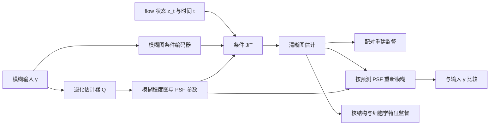
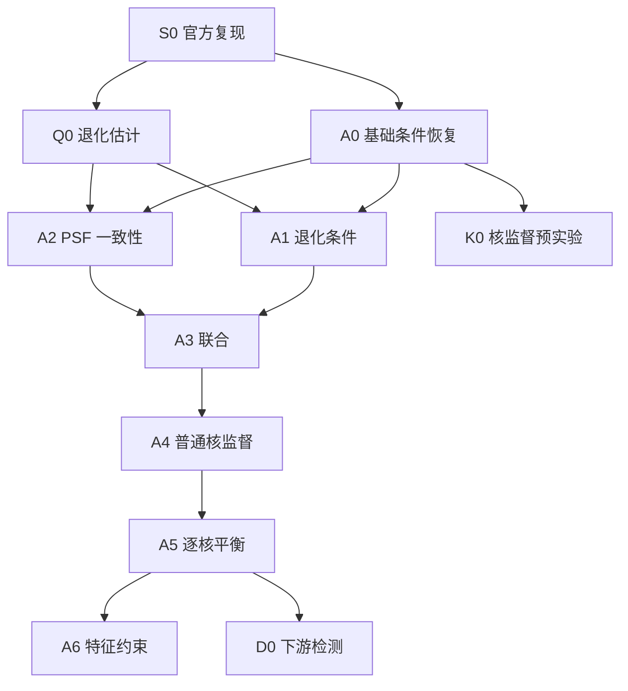

# 宫颈细胞图像清晰化项目：任务阶段推进

## 1. 文档目的

本文把项目方法拆成能够逐项实现、逐项验证的实验阶段，避免一次加入多个模块后无法判断结果来自哪里。

本文中的状态含义：

- **已完成**：已有代码、日志或可复现结果支持。
- **进行中**：已经开始实现，但尚未达到验收条件。
- **待开展**：依赖前一阶段结果，当前不应作为已完成功能描述。
- **接口已预留**：只有参数或代码位置，不能等同于功能已经实现。

实验编号 `A0～A6`、开题报告中的“模块 A/B/C”和团队中的“成员 A/B/C”不是同一套命名：

- 开题报告模块 A：局部退化估计。
- 开题报告模块 B：条件生成恢复。
- 开题报告模块 C：训练期结构检查。
- 成员 A：主责 JiT 基础恢复 A0。
- 成员 B：主责 VAE 检查与核结构监督。
- 成员 C：主责退化估计及 A1～A3 的 PSF 接口。

## 2. 最终方法概览



最终系统希望同时具备三种约束：

1. **输入条件约束**：恢复结果必须对应当前模糊图中的同一批细胞。
2. **物理一致性约束**：恢复图按估计 PSF 重新模糊后应能解释输入。
3. **核结构约束**：细胞核数量、区域、边界和特征应接近可信清晰参考。

这些约束必须分阶段加入，不能第一轮同时启用。

## 3. 阶段总览

| 阶段 | 方法组成 | 主要问题 | 当前状态 |
|---|---|---|---|
| S0 | 官方 JiT 权重与采样 | 环境、权重、前向、反向是否可用 | 已完成 |
| A0 | 模糊图条件 JiT | 基础条件恢复是否可行 | 本地静态代码路径已完成；待 GPU 运行验证与训练 |
| Q0 | 独立退化估计器 | 能否从模糊图预测有效退化表示 | 成员 C 主责，待独立验证 |
| A1 | A0 + 预测退化条件 | 显式告诉模型哪里模糊是否有帮助 | 待 A0 与 Q0 |
| A2 | A0 + PSF 一致性 | 重新模糊约束是否有帮助 | 接口待准备，正式训练在主干确定后 |
| A3 | A1 + PSF 一致性 | 条件和物理约束联合是否有额外收益 | 待 A1/A2 |
| K0 | A0 + 普通核区域/边界监督 | 核监督能否产生初步收益 | 成员 B 主责，待 A0 checkpoint |
| A4 | A3 + 普通核监督 | 完整主干上的核监督收益 | 待 A3 |
| A5 | A3 + 逐核平衡监督 | 小核是否能获得公平训练权重 | 待 A4 |
| A6 | A5 + 细胞学特征约束 | 高层细胞学特征是否带来额外收益 | 后期可选 |
| D0 | 固定异常细胞检测器评价 | 恢复是否改善实际检出 | 主方法冻结后开展 |

## 4. S0：官方 JiT 复现

### 目标

确认官方模型能够在现有服务器上加载和运行，为后续改造提供可信起点。

### 已完成证据

- 环境：`jit-a0`。
- PyTorch：`2.12.1+cu130`。
- GPU：NVIDIA RTX PRO 6000 Blackwell Server Edition。
- checkpoint：`JiT/pretrained/jit-b-16/checkpoint-last.pth`。
- JiT-B/16 权重严格匹配。
- 前向、反向和单张采样冒烟测试通过。
- 已记录显存与耗时。

### 阶段结论

只证明官方 JiT 可运行，不代表已经完成宫颈细胞去模糊。

## 5. A0：模糊图条件下的基础 JiT 恢复

### 5.1 数学定义

训练时读取同一视野的模糊图 `y` 与清晰目标 `x`，采样噪声 `ε` 和时间 `t`：

\[
z_t=(1-t)\epsilon+tx.
\]

JiT 读取当前 flow 状态、时间和模糊图空间条件：

\[
\hat x_t=f_\theta(z_t,t,c_y(y)).
\]

由清晰终点估计换算速度：

\[
\hat v_t=\frac{\hat x_t-z_t}{1-t}.
\]

推理时从随机噪声开始，在所有 ODE 步中固定使用同一张模糊图条件，最终生成与输入对应的清晰细胞图。

### 5.2 A0 使用与不使用的信息

A0 使用：

- 模糊图 `y`；
- 清晰目标 `x`，仅用于训练；
- flow 中间状态 `z_t`；
- 生成时间 `t`；
- 官方 JiT 预训练权重。

A0 不使用：

- 模糊程度图；
- PSF 参数；
- 核掩膜；
- 异常细胞框；
- UniCAS/Smart-CCS 特征。

### 5.3 A0 子阶段

| 子阶段 | 工作 | 验收条件 | 当前状态 |
|---|---|---|---|
| A0-N | 网络结构改造 | 模型接口支持 `clear, blur`；生成接口只需要 `blur` | 代码完成，待服务器运行验证 |
| A0-D | 配对数据接入 | 能按 manifest 同步读取、裁剪和增强 blur/clear | 代码完成，正式模式强制校验 2,000/300 条记录 |
| A0-O | 8～32 对过拟合 | loss 明显下降，结果对应同一批细胞，条件未被忽略 | 入口完成，待 GPU 实验 |
| A0-T | 2,000 对训练 | 可重复训练并保存 checkpoint、日志和固定样本 | 入口完成，待 GPU 实验 |
| A0-V | 300 对固定验证 | 输出完整，计算 PSNR/SSIM/LPIPS 和资源指标 | 生成与公共评价入口完成，待训练后运行 |
| A0-ID | A0 内的清晰保持训练与对照 | 少量加入清晰→同一清晰训练对，并比较有/无恒等训练的收益与代价 | 数据混合参数已实现，对照实验待运行 |

这里的“代码完成”只表示静态实现已接通，不代表实验通过。A0 只有在 GPU 服务器完成 A0-O、A0-T 与 A0-V，并保存日志、checkpoint 和评价结果后，才能标记为“已完成”。

### 5.4 A0 中的清晰→清晰恒等训练

A0 不应只学习“输入进来就要修改”。真实视野可能只有局部模糊，也可能整体已经足够清晰，因此 A0 训练集中应少量加入：

\[
y_{\mathrm{id}}=x,
\qquad
x_{\mathrm{target}}=x.
\]

这里仍然从随机噪声构造 flow 状态：

\[
z_t=(1-t)\epsilon+tx,
\]

网络读取清晰条件图 `x`，目标仍是同一张 `x`。它不是把清晰图直接复制到输出，也没有改变 JiT 的噪声起点。

实现上，现有 A0 网络接口不需要增加新模块：

```python
# 普通恢复样本
loss_restore = denoiser(clear=x, blur=y)

# 恒等样本：条件与目标使用同一清晰图
loss_identity_pair = denoiser(clear=x, blur=x)
```

恒等训练首先是一种**训练对构造方式**。当前 flow loss 已经会监督网络把清晰条件对应到相同清晰目标，不一定必须额外再定义一个完全独立的 `identity loss`。如果后续增加 L1/SSIM 清晰保持项，应单独记录权重和增量效果，避免与 flow 主损失重复计权后压制恢复能力。

建议把恒等样本比例 `p_id` 设为可配置超参数，首轮只测试较小比例，例如 10%～25%，具体值由验证结果决定。恒等约束过强会让模型倾向于照抄输入，导致真正模糊区域恢复不足。

必须进行成对对照：

- `A0-no-id`：不加入清晰→清晰训练对；
- `A0-id`：加入少量清晰→清晰训练对；
- 两组使用同一初始化、训练数据、训练步数、采样器和评价协议。

只有同时满足“清晰输入修改更少”且“模糊输入恢复没有明显下降”，才保留恒等训练。该对照属于 A0 内部训练设计，不是 A1，也不使用 PSF、核掩膜或退化估计器。

### 5.5 A0 数据

- 训练：`prepared/manifests/debug_train.jsonl`，2,000 对。
- 验证：`prepared/manifests/debug_val.jsonl`，300 对。
- blur/clear 必须来自同一视野。
- 裁剪、翻转、旋转必须同步执行。
- 公共输入输出格式为 RGB float32 `[0,1]`；进入 JiT 时再转换到官方所需范围。
- 恒等训练对只能由训练划分中的清晰图构造；不能用验证或测试清晰图生成训练样本。

### 5.6 A0 评价

至少报告：

- 输入模糊图相对清晰目标的 PSNR/SSIM/LPIPS；
- A0 恢复图相对清晰目标的 PSNR/SSIM/LPIPS；
- 固定样本的模糊图、恢复图、清晰目标与误差图；
- 峰值显存；
- 每步训练时间；
- 单图推理时间与采样步数；
- 失败案例，包括结构错位、核粘连、虚假纹理和颜色漂移。
- 单独准备清晰输入保持评价，比较输出与输入的 PSNR/SSIM/LPIPS、颜色漂移和核边界变化。

## 6. Q0：独立退化估计器

### 目标

从模糊输入预测受限制、可检查的有效退化表示：

\[
a(y)=Q_\phi(y).
\]

推荐首期输出：

- 连续模糊程度图；
- 局部高斯尺度；或
- 少量预设 PSF 核的混合权重。

若使用 `J` 个预设核，位置 `p` 的权重满足：

\[
a_j(p)\ge 0,\qquad \sum_{j=1}^{J}a_j(p)=1.
\]

重新模糊算子为：

\[
\mathcal B_a(x)(p)=\sum_{j=1}^{J}a_j(p)(k_j*x)(p).
\]

### 训练顺序

1. 用已知 PSF 的合成数据训练。
2. 在合成验证集报告参数误差和可视化。
3. 在真实配对上检查 `B_{a(y)}(x)` 是否能近似 `y`。
4. 验证后先固定退化估计器，再接恢复模型。
5. 只有消融支持时才考虑联合微调。

负责人：成员 C。成员 A 不实现该网络，但负责预留并约定接口。

## 7. A1～A3：退化条件与 PSF 一致性消融

| 版本 | 模糊图条件 | 预测退化条件 | PSF 一致性损失 |
|---|---:|---:|---:|
| A0 | 是 | 否 | 否 |
| A1 | 是 | 是 | 否 |
| A2 | 是 | 否 | 是 |
| A3 | 是 | 是 | 是 |

### A1：退化作为额外输入

\[
c_a=E_a(a(y)),
\qquad
\hat x_t=f_\theta(z_t,t,c_y,c_a).
\]

目的：检验显式告诉 JiT“哪里模糊、怎样模糊”是否优于只输入 RGB 模糊图。

### A2：退化只用于物理一致性

JiT 输入与 A0 相同，但增加：

\[
\hat y=\mathcal B_{a(y)}(\hat x_t),
\qquad
\mathcal L_{\mathrm{PSF}}=\|\hat y-y\|_1.
\]

目的：检验恢复结果能否在估计的退化过程中解释输入。

### A3：两种作用联合

\[
\mathcal L=
\mathcal L_{\mathrm{flow}}
+\lambda_{\mathrm{rec}}\mathcal L_{\mathrm{rec}}
+\lambda_{\mathrm{PSF}}\mathcal L_{\mathrm{PSF}}.
\]

目的：检验“作为条件”和“作为物理损失”是否有联合增益。

## 8. K0、A4、A5：核结构监督

### K0

在 A0 checkpoint 基础上，使用同一批 CNSeg 数据、相同步数和相同初始化，比较：

- A0 + CNSeg，不加核损失；
- K0 = A0 + CNSeg，加入普通核区域/边界损失。

只有这样才能把差异归因于核损失，而不是额外数据。

### A4

在正式选定主干的 A3 上加入普通核区域与边界监督。

### A5

对每个核分别计算区域、边界和局部特征损失，再在核实例之间平均，避免背景和大核支配训练。

核掩膜只用于训练与评价，推理时不能作为额外输入。

## 9. A6：细胞学特征约束

使用冻结的 UniCAS 或 Smart-CCS 编码器，比较恢复图与清晰目标的局部或多层特征：

\[
\mathcal L_{\mathrm{feature}}=d(F(\hat x),F(x)).
\]

该编码器是训练期检查器，不是 A0 的模糊图条件编码器。A6 只有在 A0～A5 结果清楚后再决定是否开展。

## 10. 下游检测与 ComparisonDetector

ComparisonDetector 的异常细胞框和类别用于主恢复方法冻结后的独立下游评价：

```text
模糊原图 → 固定检测器
恢复图   → 同一个固定检测器
清晰目标 → 同一个固定检测器
```

比较召回、误检和 mAP，判断恢复是否真正帮助异常细胞检出。它不是 A0 训练的前置条件。

## 11. 阶段依赖与停止条件



进入下一阶段前至少满足：

1. 当前阶段能够重复运行。
2. 使用固定数据划分和随机种子协议。
3. 有定量指标、固定可视化和失败案例。
4. 与上一阶段只改变一个主要因素。
5. 如果没有稳定收益，应分析并停止扩展，而不是默认保留模块。

## 12. 当前最近一步

当前分支已静态接通 A0-N、A0-D、A0-O、A0-T、A0-V 和 A0-ID 的代码路径，但尚未在有 PyTorch/GPU 的服务器运行。下一步应按顺序完成：

1. 在服务器拉取当前分支并确认 A0 专用入口能够加载官方权重。
2. 使用 `--overfit_samples 16` 完成小样本过拟合，检查 loss、条件对应关系和输出文件。
3. 过拟合通过后，使用完整 2,000 对进行正式训练。
4. 用训练后的 A0 checkpoint 恢复固定 300 对，并运行公共 PSNR/SSIM/LPIPS 评价。
5. 固定其他设置，对比 `--identity_ratio 0` 与候选恒等比例；根据清晰保持和模糊恢复两方面结果决定是否保留。

